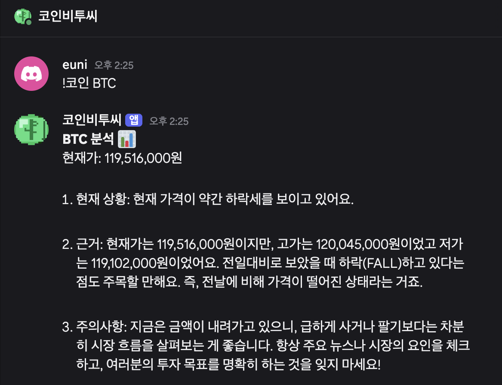
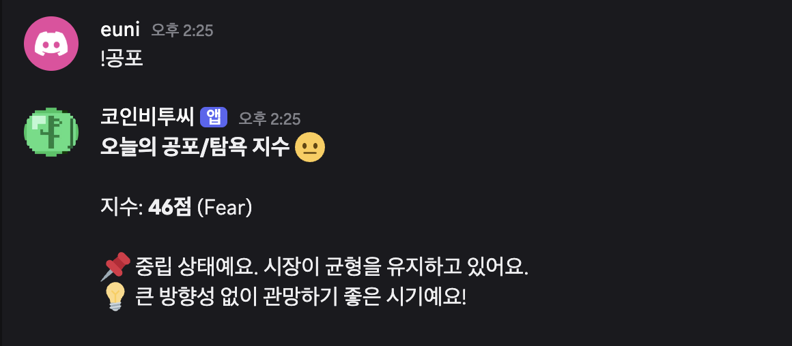
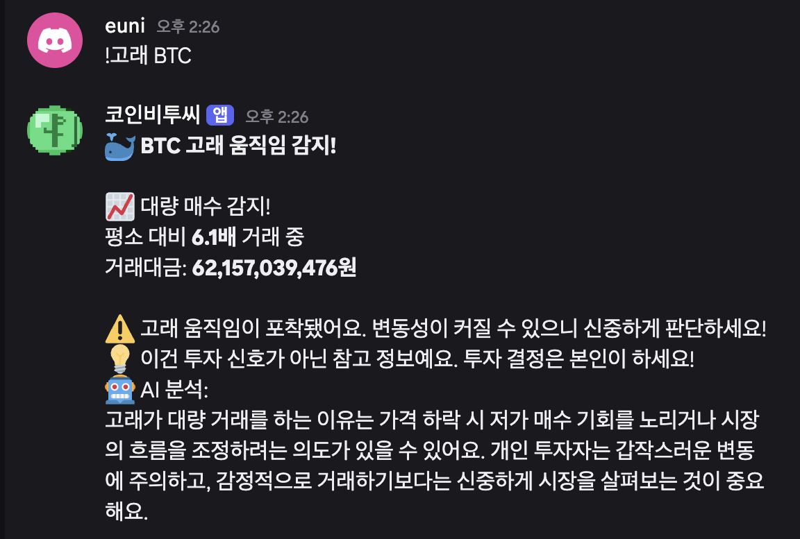
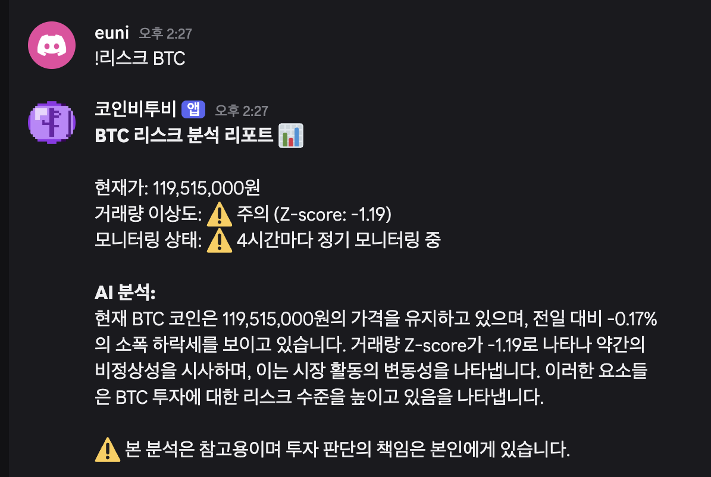
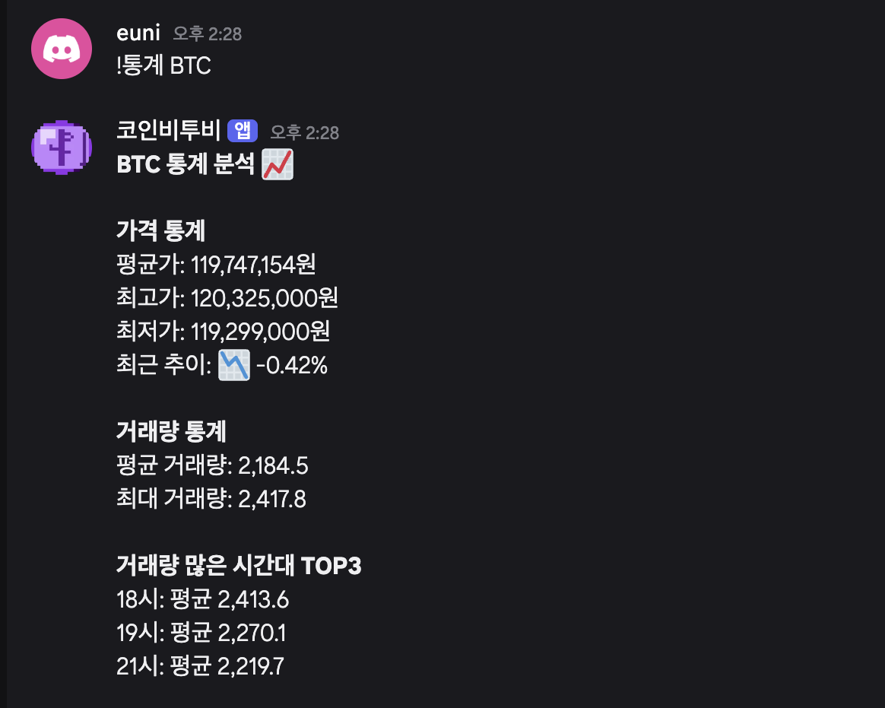
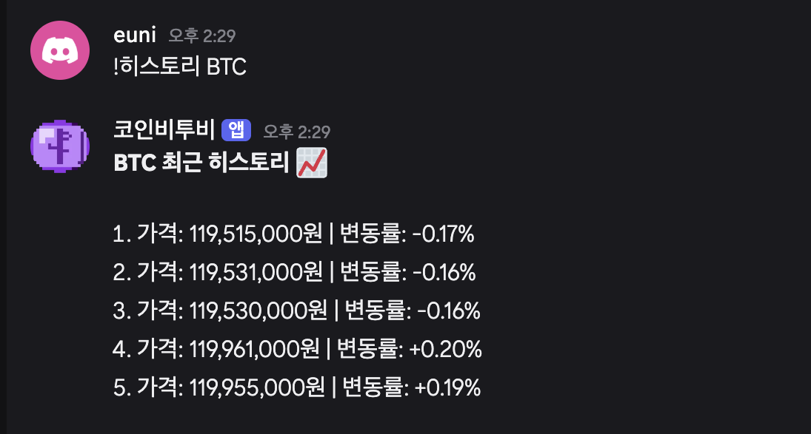
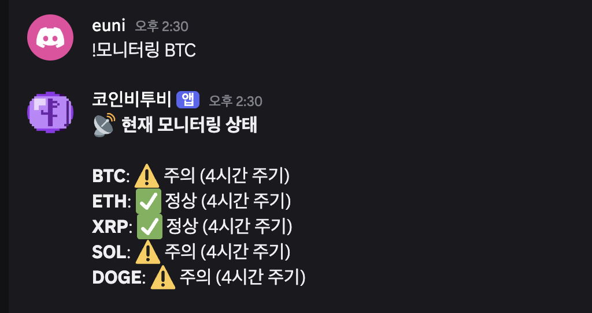

# 🪙 Coin Analysis Bot

> **"데이터는 넘치지만 판단은 부족한 시대, 기술로 그 격차를 메우다"**

오늘도 누군가는 급등 알림에 잠을 깼고, 수익 인증 게시물에 불안해졌습니다.  
SNS와 정보 과잉 속에서 FOMO(Fear Of Missing Out)로 인한 감정적 투자가 만연한 시대.  
이 프로젝트는 사용자가 데이터에 기반한 주체적 판단을 내릴 수 있도록 돕고,  
올바른 투자 가치관을 확립하는 것에서 더 나아가 건강한 금융 생태계를 만드는 것을 목표로 합니다.

---

## 💚 B2C 봇 — 코인비투씨

**대상:** 개인 투자자  
**목표:** FOMO 방지, 데이터 기반 자주적 판단 지원

### 기능

| 명령어 | 설명 |
|--------|------|
| `!코인 BTC` | 현재가 + GPT 기반 친근한 분석 (현재 상황 / 근거 / 주의사항) |
| `!공포` | 공포/탐욕 지수 조회 + 투자자 맞춤 조언 |
| `!고래 BTC` | 고래 움직임 감지 + AI 리스크 분석 |
| 자동 | 4시간마다 주요 코인 시장 현황 자동 전송 |

### 실행 화면





> 업비트를 포함한 대부분의 거래소에서 4시간 캔들을 주요 기술적 분석 단위로 사용하는 만큼,  
> 시장 참여자들의 분석 단위에 맞춰 설정했습니다.

---

## 💜 B2B 봇 — 코인비투비

**대상:** 금융 기업, 자산운용사  
**목표:** 리스크 기반 모니터링을 통해 집중 감시 대상 중심으로 인력 배치하여 한정된 자원의 효율적 배분 지원

> 현재 버전은 시장 영향력 상위 5개 대형 코인을 중심으로 **시장 전체 리스크를 모니터링**합니다.  
> 실제 이상 거래는 유동성이 낮은 소형 알트코인에서 더 빈번하게 발생하는 만큼,  
> 향후 소형 알트코인 이상 거래 감지로 확장하는 것을 목표로 합니다.

### 기능

| 명령어 | 설명 |
|--------|------|
| `!리스크 BTC` | Z-score 기반 이상 거래 감지 + AI 리스크 리포트 |
| `!통계 BTC` | 가격/거래량 통계 + 시간대별 분석 + 이상 감지 이력 |
| `!히스토리 BTC` | 최근 가격 히스토리 조회 |
| `!모니터링` | 전체 코인 모니터링 상태 조회 |
| 자동 | 30분마다 데이터 수집 → 이상 감지 시 모니터링 주기 자동 전환 |

### 실행 화면






### 동적 모니터링 시스템

이상 징후의 심각도에 따라 모니터링 주기를 자동으로 조정합니다.

```
✅ 정상 (Z-score < 1.0)   → 4시간마다 정기 리포트
⚠️ 주의 (Z-score 1.0~2.0) → 4시간 유지, 모니터링 강화
🔶 경고 (Z-score 2.0~3.0) → 30분마다 자동 리포트
🚨 위험 (Z-score > 3.0)   → 10분마다 긴급 리포트
```

> 이상 거래 징후를 사전에 감지하고 한정된 인력이 위험도 높은 상황에  
> 즉각 집중할 수 있도록 돕는 **리스크 기반 모니터링**을 목표로 합니다.

### 모니터링 대상 코인 선정 기준

| 코인 | 선정 이유 |
|------|----------|
| BTC | 시장 지배력 1위, 전체 시장 흐름 대표 |
| ETH | 시가총액 2위, DeFi 생태계 대표 |
| XRP | 국내 거래량 상위, 기관 투자 관심 집중 |
| SOL | 고성장 레이어1 프로젝트 대표 |
| DOGE | 소셜미디어 영향력 높은 밈코인 대표 |

> 비트코인 도미넌스 이론에 따르면 시장 지배력이 높은 BTC의 움직임이 전체 알트코인 시장에 선행하는 경향이 있습니다. 따라서 시장 영향력 상위 5개 코인의 동향이 시장의 큰 흐름을 반영한다고 판단했습니다.

---

## 🛠 기술 스택

| 구분 | 기술 |
|------|------|
| 언어 | Python |
| 봇 프레임워크 | Discord.py |
| 비동기 HTTP | aiohttp |
| AI | OpenAI API (GPT-4o-mini) |
| 데이터 | 업비트 API, Alternative.me API |
| DB | SQLite (coin_history / alert_history / monitoring_log) |
| 버전 관리 | Git / GitHub |

---

## ⚙️ 실행 방법

### 1. 패키지 설치

```bash
pip3 install discord.py aiohttp openai python-dotenv
```

### 2. 환경변수 설정

`.env` 파일을 생성하고 아래 내용을 입력하세요:

```
B2C_DISCORD_TOKEN=your_token
B2B_DISCORD_TOKEN=your_token
OPENAI_KEY=your_key
B2C_CHANNEL_ID=your_channel_id
B2B_CHANNEL_ID=your_channel_id
```

### 3. 실행

```bash
python3 coin_b2c.py   # B2C 봇
python3 coin_b2b.py   # B2B 봇
```

---

## 💡 개발 배경과 철학

넷플릭스 데이터 분석 프로젝트를 진행하며 인터넷 상 모두에게 공개되어 있는 데이터일지라도 **해석의 층위, 즉 리터러시가 인사이트의 양을 결정한다**는 것을 깨달았습니다.  
동시에 이러한 데이터의 방대함이 정보 격차를 심화시켜 개인이 명확한 주관과 판단 기준을 확립하기 어려운 환경을 만든다는 것도 발견했습니다.

특히 금융 시장에서 이 현상은 극단적으로 나타납니다.  
SNS 속 수익 인증, 급등 알림, 묻지마 투자 — 이 모든 것이 FOMO를 자극하고 감정적 판단을 유도합니다.

> *"기술은 강자가 아닌 약자를 보호하는 도구가 되어야 한다"*

B2C 봇은 개인 투자자가 감정이 아닌 데이터로 판단할 수 있게 돕고,  
B2B 봇은 기업이 이상 거래를 선제적으로 감지해 시장 전체를 건강하게 만드는 데 기여합니다.

---

## 📌 현재 한계

- **단일 거래소:** 업비트 단일 거래소 기준으로 국내외 시장 전체를 반영하는 데 한계
- **대형 코인 중심:** 실제 이상 거래는 유동성이 낮은 소형 알트코인에서 더 빈번하게 발생하나 현재 미포함
- **플랫폼 종속:** 디스코드 특성상 투자 일지 등 히스토리 관리 어려움
- **로컬 환경:** 로컬 실행으로 24시간 연속 운영 불가
- **FDS 고도화 부족:** 이상 거래 수법 변화를 실시간으로 반영하지 못함

## 🎯 향후 개발 목표

- **소형 알트코인 감지 확장:** 유동성이 낮아 이상 거래가 빈번한 소형 알트코인으로 감시 범위 확대
- **멀티 거래소 통합:** 바이낸스, 빗썸 등 주요 거래소 데이터를 통합해 신뢰도 높은 분석 제공
- **웹 대시보드 개발:** 데이터 시각화 기반 독립적 서비스로 발전, 투자 패턴 히스토리 관리
- **클라우드 배포:** AWS/Azure 기반 24시간 운영 환경 구축
- **FDS 고도화:** AI를 활용해 변화하는 이상 거래 수법을 빠르게 반영하고 탐지 시스템 지속 업데이트

